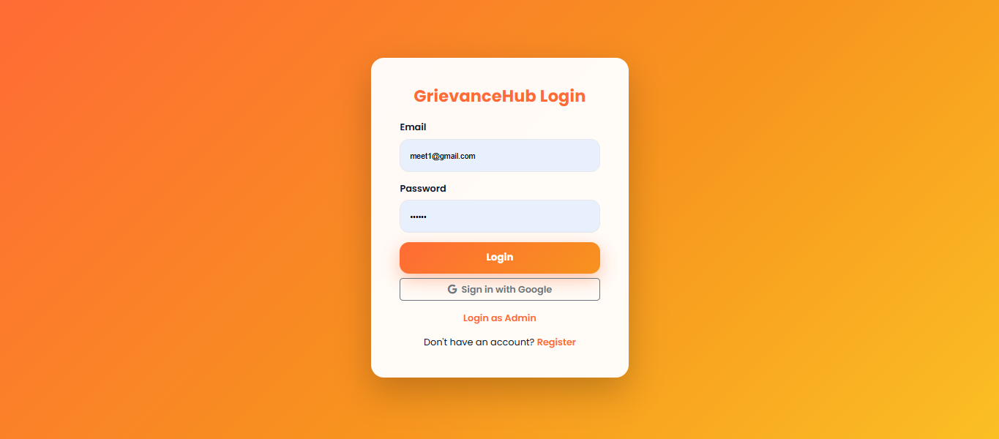
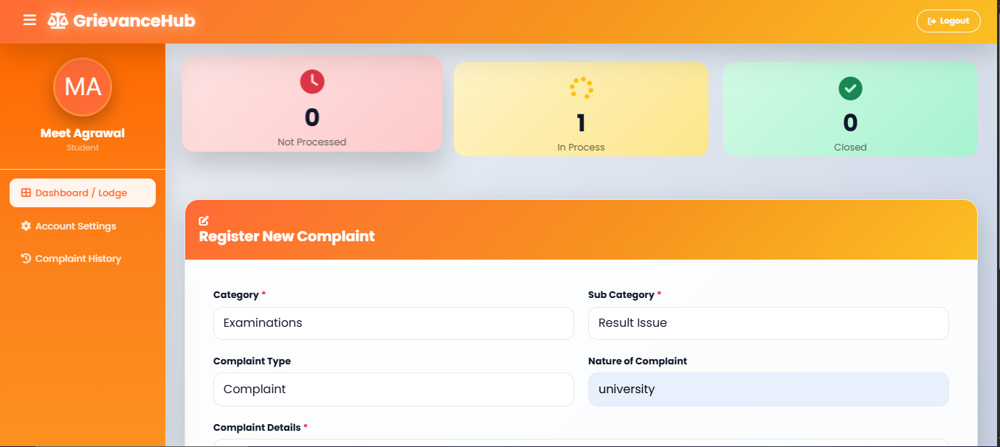
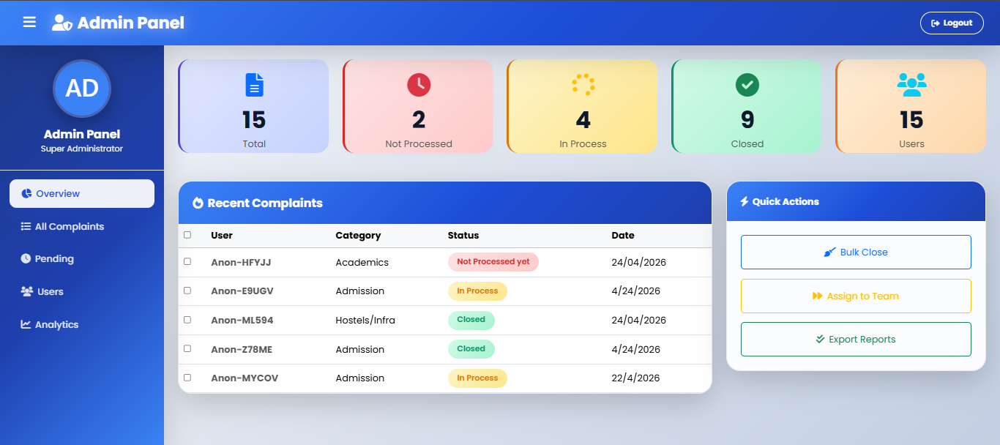
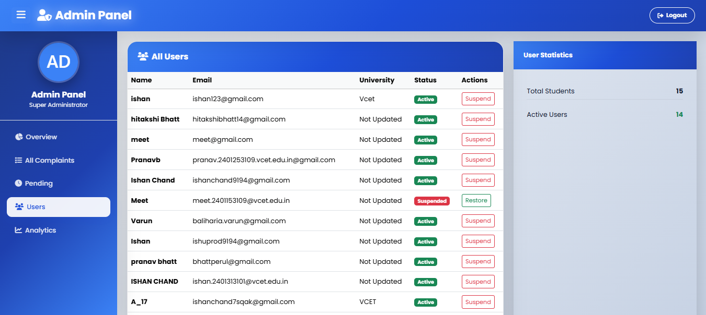

# 📢 GrievanceHub — Student Grievance Management System

> A full-stack web application that allows students to submit, track, and manage grievances — with a secure admin portal for reviewing, processing, and resolving complaints in real time.

🌐 **Live Demo:** [https://student-grievance-e3c67.web.app](https://student-grievance-e3c67.web.app)

---

## 📸 Screenshots

> 

> 

> 

> 

---

## video

https://github.com/user-attachments/assets/7429a119-15ac-4f12-86c8-984f70b5404c

--

## 📌 Table of Contents

- [Overview](#overview)
- [Problem Statement](#problem-statement)
- [Features](#features)
- [Tech Stack](#tech-stack)
- [System Architecture](#system-architecture)
- [Project Structure](#project-structure)
- [API Endpoints](#api-endpoints)
- [Getting Started](#getting-started)
- [User Roles](#user-roles)
- [Deployment](#deployment)
- [Future Scope](#future-scope)
- [Team](#team)

---

## Overview

**GrievanceHub** is a student grievance portal built for educational institutions. It enables students to formally submit complaints across categories like Academics, Fees, and Hostel — and track their resolution status in real time. Admins get a dedicated secure dashboard to view, process, update, and manage all incoming complaints and registered users.

The system uses **Firebase Authentication** for secure login (including Google Sign-In), **Firebase Firestore** as the live database, a **Node.js + Express** REST API deployed on **Render**, and the **Frontend hosted on Firebase Hosting**.

---

## Problem Statement

In most colleges, students have no formal, transparent channel to raise complaints:

- Complaints go through paper forms, emails, or verbal requests — easily lost or ignored
- Students have no way to track if their complaint is being processed
- Admins have no central view of all complaints or their resolution status
- There is no accountability — complaints can go unaddressed indefinitely

**GrievanceHub solves this** with a structured, role-based digital platform where every complaint is tracked from submission to closure.

---

## Features

### Student Features
| Feature | Status |
|---|---|
| Register with email or Google Sign-In | ✅ |
| Secure login with session persistence | ✅ |
| Submit grievance with category, subcategory, nature, and details | ✅ |
| View personal complaint history with live status | ✅ |
| View admin response / notes on complaints | ✅ |
| Withdraw (delete) complaint before admin processes it | ✅ |
| Edit personal profile (PRN, university, department, year, contact) | ✅ |
| Dashboard stats — Pending, In Process, Closed complaints | ✅ |

### Admin Features
| Feature | Status |
|---|---|
| Dedicated admin login portal (admin@grievancehub.com) | ✅ |
| Overview dashboard with total, pending, in-process, closed stats | ✅ |
| View all complaints with anonymous student IDs | ✅ |
| Filter complaints by status | ✅ |
| Update complaint status (Not Processed → In Process → Closed) | ✅ |
| Add admin notes / resolution remarks to complaints | ✅ |
| Delete complaints | ✅ |
| View all registered students and manage user status (Active / Suspended) | ✅ |
| Charts and analytics on complaint distribution | ✅ |

### System Features
| Feature | Status |
|---|---|
| Firebase JWT token verification on every API request | ✅ |
| Role-separated routing (student vs admin) | ✅ |
| GitHub Actions workflow to keep Render backend awake (every 14 min) | ✅ |
| Server wake-up ping with loading overlay on page load | ✅ |
| UI sound effects on button interactions | ✅ |
| Responsive sidebar with toggle | ✅ |
| 404 error page | ✅ |

---

## Tech Stack

### Frontend
| Technology | Purpose |
|---|---|
| HTML5 | Page structure and layout |
| CSS3 + Bootstrap 5 | Styling, responsiveness, modals |
| JavaScript (ES Modules) | Application logic, Firebase SDK calls |
| Firebase JS SDK v10.7.1 | Auth, Firestore (loaded via CDN) |

### Backend
| Technology | Purpose |
|---|---|
| Node.js + Express 5 | REST API server |
| Firebase Admin SDK | Server-side Firestore access and token verification |
| JSON Web Tokens (JWT) | Firebase token validation via `verifyIdToken` |
| bcrypt | Password utility |
| dotenv | Environment variable management |
| CORS | Cross-origin request handling |

### Infrastructure
| Service | Purpose |
|---|---|
| Firebase Authentication | User login, Google Sign-In, session management |
| Firebase Firestore | NoSQL cloud database for users and complaints |
| Firebase Hosting | Frontend static site hosting |
| Render | Node.js backend deployment |
| GitHub Actions | Automated keep-alive ping to Render every 14 minutes |

---

## System Architecture

```
┌─────────────────────────────────────────────────────┐
│                   Student / Admin                   │
│              (Browser — Firebase Hosting)           │
│                                                     │
│   index.html → login.html → dashboard.html          │
│                           → admin.html              │
└─────────────┬───────────────────────┬───────────────┘
              │  Firebase Auth SDK    │  Fetch API
              ▼                       ▼
┌─────────────────────┐   ┌──────────────────────────┐
│  Firebase Auth      │   │  Node.js + Express       │
│  (Login / Signup /  │   │  (Render Cloud)          │
│   Google Sign-In)   │   │                          │
│                     │   │  /api/complaints  (CRUD) │
│  Returns JWT Token  │   │  /api/admin       (CRUD) │
└─────────────────────┘   │  /api/ping        (wake) │
                          └────────────┬─────────────┘
                                       │ Firebase Admin SDK
                                       ▼
                          ┌──────────────────────────┐
                          │  Firebase Firestore      │
                          │                          │
                          │  collections/            │
                          │   ├── users/             │
                          │   └── complaints/        │
                          └──────────────────────────┘
```

---

## Project Structure

```
Mini-project--Grevience-management-system/
│
├── Frontend/                        # Static site (hosted on Firebase Hosting)
│   ├── index.html                   # Landing page
│   ├── login.html                   # Login page (Student + Admin toggle)
│   ├── login.js                     # Firebase login logic (email + Google)
│   ├── signup.html                  # Student registration page
│   ├── signup.js                    # Firebase signup + Firestore user creation
│   ├── dashboard.html               # Student dashboard
│   ├── dashboard.js                 # Complaint submission, history, profile
│   ├── admin.html                   # Admin panel
│   ├── admin.js                     # Admin complaint/user management
│   ├── firebase-config.js           # Firebase project configuration
│   ├── layout.js                    # Shared layout logic
│   ├── ui.js                        # Sidebar toggle utility
│   ├── app.css                      # Global styles
│   ├── 404.html                     # Custom 404 error page
│   └── index.firebase.html          # Firebase Hosting entry alternative
│
├── Backend/                         # REST API (deployed on Render)
│   ├── server.js                    # Express server setup, CORS, routes
│   ├── firebaseAdmin.js             # Firebase Admin SDK initialization
│   ├── complaintController.js       # Complaint route handlers
│   ├── middleware/
│   │   └── authMiddleware.js        # JWT token verification middleware
│   ├── routes/
│   │   ├── complaintRoutes.js       # POST, GET, DELETE /api/complaints
│   │   └── adminRoutes.js           # GET, PUT, DELETE /api/admin/*
│   └── package.json                 # Backend dependencies
│
├── dataconnect/                     # Firebase Data Connect (schema / queries)
│   ├── schema/schema.gql            # GraphQL schema definition
│   ├── seed_data.gql                # Seed data for testing
│   └── example/queries.gql         # Sample queries
│
├── .github/
│   └── workflows/
│       └── keep_alive.yml           # GitHub Actions: ping Render every 14 min
│
├── firebase.json                    # Firebase Hosting + Data Connect config
├── .firebaserc                      # Firebase project alias
└── README.md
```

---

## API Endpoints

### Complaint Routes — `/api/complaints`
All routes require a valid Firebase JWT token in the `Authorization: Bearer <token>` header.

| Method | Endpoint | Description |
|---|---|---|
| `POST` | `/api/complaints` | Submit a new complaint (linked to authenticated user) |
| `GET` | `/api/complaints` | Get all complaints for the logged-in student |
| `DELETE` | `/api/complaints/:id` | Withdraw a complaint (only if status is "Not Processed yet") |

### Admin Routes — `/api/admin`
All routes require authentication AND `admin@grievancehub.com` identity.

| Method | Endpoint | Description |
|---|---|---|
| `GET` | `/api/admin/complaints` | Get all complaints (ordered by date) |
| `PUT` | `/api/admin/complaints/:id/status` | Update complaint status and add admin note |
| `DELETE` | `/api/admin/complaints/:id` | Delete a complaint |
| `GET` | `/api/admin/users` | Get all registered students |
| `PUT` | `/api/admin/users/:id/status` | Suspend or restore a user account |

### Utility
| Method | Endpoint | Description |
|---|---|---|
| `GET` | `/api/ping` | Keep-alive ping for Render cold start prevention |

---

## Getting Started

### Prerequisites

- [Node.js](https://nodejs.org/) v18+
- [Firebase CLI](https://firebase.google.com/docs/cli) (`npm install -g firebase-tools`)
- A [Firebase Project](https://console.firebase.google.com/) with **Authentication** and **Firestore** enabled
- A [Render](https://render.com/) account for backend deployment (or run locally)

---

### Step 1 — Clone the Repository

```bash
git clone https://github.com/ishu9194/Mini-project--Grevience-management-system.git
cd Mini-project--Grevience-management-system
```

---

### Step 2 — Configure Firebase (Frontend)

Open `Frontend/firebase-config.js` and replace the config object with your own Firebase project credentials from the [Firebase Console](https://console.firebase.google.com/):

```js
const firebaseConfig = {
  apiKey: "YOUR_API_KEY",
  authDomain: "YOUR_PROJECT.firebaseapp.com",
  projectId: "YOUR_PROJECT_ID",
  storageBucket: "YOUR_PROJECT.appspot.com",
  messagingSenderId: "YOUR_SENDER_ID",
  appId: "YOUR_APP_ID"
};
```

---

### Step 3 — Set Up the Backend

```bash
cd Backend
npm install
```

Create a `.env` file in the `Backend/` directory:

```env
PORT=5000
GOOGLE_APPLICATION_CREDENTIALS=./serviceAccountKey.json
```

Download your **Firebase Service Account Key** from:
Firebase Console → Project Settings → Service Accounts → Generate New Private Key

Save the JSON file as `Backend/serviceAccountKey.json`.

> ⚠️ Never commit `serviceAccountKey.json` to version control. It is already in `.gitignore`.

---

### Step 4 — Run the Backend Locally

```bash
cd Backend
npm start
```

Server will start at `http://localhost:5000`.

---

### Step 5 — Run the Frontend Locally

Open `Frontend/index.html` using [VS Code Live Server](https://marketplace.visualstudio.com/items?itemName=ritwickdey.LiveServer) or:

```bash
npx serve Frontend
```

> ⚠️ The frontend uses ES Modules and Firebase CDN — it must be served over HTTP, not opened as a `file://` URL.

---

## User Roles

| Role | Credentials | Access |
|---|---|---|
| **Student** | Register via email or Google | Submit complaints, track status, manage profile |
| **Admin** | `admin@grievancehub.com` | Full dashboard — view all complaints, update status, manage users |

> The admin account must be pre-created in Firebase Authentication with the exact email `admin@grievancehub.com`.

---

## Deployment

### Frontend — Firebase Hosting

```bash
firebase login
firebase init hosting        # Select Frontend/ as public directory
firebase deploy --only hosting
```

### Backend — Render

1. Push the `Backend/` folder to a GitHub repo (or use the full repo)
2. Create a new **Web Service** on [Render](https://render.com/)
3. Set build command: `npm install`
4. Set start command: `npm start`
5. Add environment variables in Render's dashboard (same as your `.env`)

### Keep-Alive (GitHub Actions)

The `.github/workflows/keep_alive.yml` automatically pings the Render backend every **14 minutes** to prevent cold starts on the free tier. No setup required — it runs automatically after pushing to GitHub.

---

## Future Scope

- 📧 **Email Notifications** — Notify students when complaint status changes
- 📱 **Mobile App** — React Native or Flutter wrapper for the platform
- 🏷️ **Complaint Categories Expansion** — Hostel, library, transport, infrastructure
- 📊 **Advanced Analytics** — Monthly trends, department-wise complaint heatmaps
- 🔒 **Multi-Admin Support** — Department-level admins with scoped complaint access
- 🌐 **Multi-language Support** — Regional language interface for wider accessibility
- ⏱️ **SLA Tracking** — Auto-escalate complaints unresolved beyond a set deadline
- 📎 **File Attachments** — Allow students to attach supporting documents or images

---

### 🚧 Currently Working On

**1. Role-Based Admin System**
* **Goal:** Replacing the hardcoded admin email with a scalable `role` field (`"student"` | `"admin"`) in Firestore.
* **Status:** Updating `authMiddleware.js` for role verification and creating a script to seed the initial admin.
* **Why:** Moves away from brittle email checks to a secure, production-ready system that supports multiple admins.

**2. API Validation & Rate Limiting**
* **Goal:** Securing the backend against spam and abuse.
* **Status:** Implementing `express-validator` to block empty/invalid complaints and `express-rate-limit` (max 5 requests per 15 mins).
* **Why:** Protects the database and ensures production-level API reliability.

**3. Data Schema Documentation**
* **Goal:** Mapping out the NoSQL database structure.
* **Status:** Adding a "Data Schema" section to this README outlining `users` and `complaints` collections, required fields, and custom indexes.
* **Why:** The code explains the API, but clear documentation is needed to explain the shape of the data.

---

## Team

**Code Mafia** — Vidyavardhini's College of Engineering & Technology
SE Computer Engineering (Second Year)

| Name | Role |
|---|---|
| Meet Agrawal | Developer |
| Pranav Bhatt | Developer |
| Ishan Chand | Developer |
| Varun Baliharia | Developer |

---

## Links

| Resource | URL |
|---|---|
| Live App | [https://student-grievance-e3c67.web.app](https://student-grievance-e3c67.web.app) |
| GitHub Repo | [https://github.com/ishu9194/Mini-project--Grevience-management-system](https://github.com/ishu9194/Mini-project--Grevience-management-system) |

---

<p align="center">Built with ❤️ by Code Mafia &nbsp;|&nbsp; VCET, Mumbai</p>
